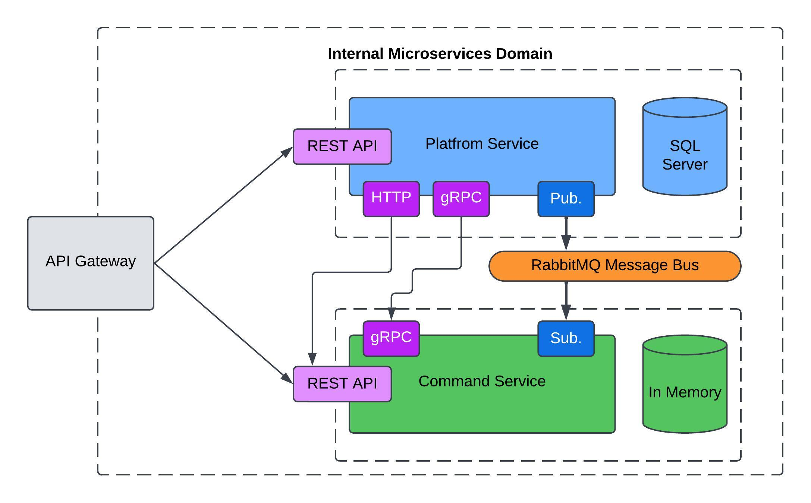

## Microservices Architecture <a href="https://github.com/PabloMusaber/microservices-architecture/" style="color: #6c757d" onMouseOver="this.style.color='#333333'" onMouseOut="this.style.color='#6c757d'" target="githubWindow"><i class="fab fa-github"></i></a>

Microservices or Microservices Architecture is an architectural pattern that consists of building a big system like a group of little systems that communicate between them.

Each service is designed to perform a specific function in the whole system and can be developed, deployed, and scaled independently. It’s crucial that each service has only one responsibility and does it well.

Within the system, microservices communicate using both synchronous and asynchronous methods. They might use REST, message queues (e.g., RabbitMQ), or gRPC, as demonstrated in this project.

<br>

### Benefits of Microservices

- Services can be scaled independently based on demand, making it unnecessary to scale the entire system and helping to optimize costs.
- Each service can be built using different technologies, allowing teams to choose the best tool for each specific use case.
- The system is resilient; if one service fails, the others can continue operating. On the other hand, in a monolith architecture, a failure in one part can bring down the entire system.
- Having separate services allows for quicker changes and deployments.

<br>

### When should you use Microservices?

Considering that this architecture is pretty difficult to implement, the decision has to be fair. It would be useful to consider using microservices when you fit with these points:

- There are many services that are going to be developed by different teams, even in different remote locations.
- Each service could have its own database.
- You would want to scale just a few services on demanded situations.
- There are different tech stacks needed per service.

If the complete system is going to be developed by the same team, using the same database and in the same technology, it’s pretty likely that using microservices architecture will be over-engineering.

<br>

---
### Project Overview

In this [repository](https://github.com/PabloMusaber/microservices-architecture/) there’s a pretty simple project built with the goal of learning **microservices architecture**, following this fantastic course: [.NET Microservices Course](https://www.youtube.com/watch?v=DgVjEo3OGBI)

The project consists of **two very simple services**:

- **Platform Service:** It just creates platform entities that have a name, a publisher, and a cost. At the moment of creating a new platform, it publishes a message to the RabbitMQ Message Bus in order to let the subscribers know that there’s a new platform.
- **Commands Service:** This service allows users to save commands for existing platforms, making it easy to reference instructions and the command line for each command. It is subscribed to the message bus to detect when a new platform is created, so it can create the same platform in its own database. Additionally, it uses gRPC at startup to pull down any platforms that it doesn’t already have.

Also, there is a _HTTP message_ that is sent to the Command Service when a platform is created, just with the goal of testing that approach.

- The Platform Service doesn’t even know that the Commands Service exists.
- It also receives an HTTP message when a platform is created, for testing purposes.

**It’s very important to consider that if both services don’t share data between them, then they’re not theoretically part of a microservice architecture.**

The solution architecture is here:



In the diagram, we can see:
- HTTP port used for testing that communication approach.
- gRPC port used for Commands Service to get available platforms.
- Publish/Subscribe pattern is used to share data through the RabbitMQ message bus.
- Each service has its own database. Platform Service uses SQL Server, and Commands Service uses an in-memory database.

<br>

---
### Running the project

It was developed using **.NET 8.0**. The project can be ejected locally in a Kubernetes cluster as a production environment. In order to do that, you have to follow the instructions below:

**Prerequisites:** Ensure you have **kubectl** installed. Follow the instructions for your operating system:

- Linux: [https://kubernetes.io/docs/tasks/tools/install-kubectl-linux/](https://kubernetes.io/docs/tasks/tools/install-kubectl-linux/)  
- Windows: [https://kubernetes.io/docs/tasks/tools/install-kubectl-windows/](https://kubernetes.io/docs/tasks/tools/install-kubectl-windows/)  

1. **Clone the repository**
```
git clone https://github.com/PabloMusaber/microservices-architecture.git
```

2. **Create a Kubernetes Secret for SQL Server**
```
kubectl create secret generic mssql --from-literal=SA_PASSWORD="pa55w0rd!"
```

3. **Apply Kubernetes Configurations:**
```
kubectl apply -f K8S/local-pvc.yaml
kubectl apply -f K8S/mssql-plat-depl.yaml
kubectl apply -f K8S/rabbitmq-depl.yaml
kubectl apply -f K8S/platforms-depl.yaml
kubectl apply -f K8S/platforms-np-srv.yaml
kubectl apply -f K8S/commands-depl.yaml
kubectl apply -f K8S/ingress-srv.yaml
```

4. **Deploy Ingress-NGINX for API Gateway**
```
kubectl apply -f https://raw.githubusercontent.com/kubernetes/ingress-nginx/controller-v1.12.0-beta.0/deploy/static/provider/cloud/deploy.yaml
```

5. **Configure Hosts File:** Add `127.0.0.1 acme.com` to your hosts file (Windows: *C:\Windows\System32\drivers\etc\hosts*, Linux: */etc/hosts*) for the API Gateway.

6. **Test with APi client**: Use the **Test_Microservices_Course_Collection.json** postman collection in your API client. You might need to disable SSL/TLS certificate validation.

<script src='https://cdn.jsdelivr.net/gh/eddymens/markdown-external-link-script@v2.0.0/main.min.js'></script>