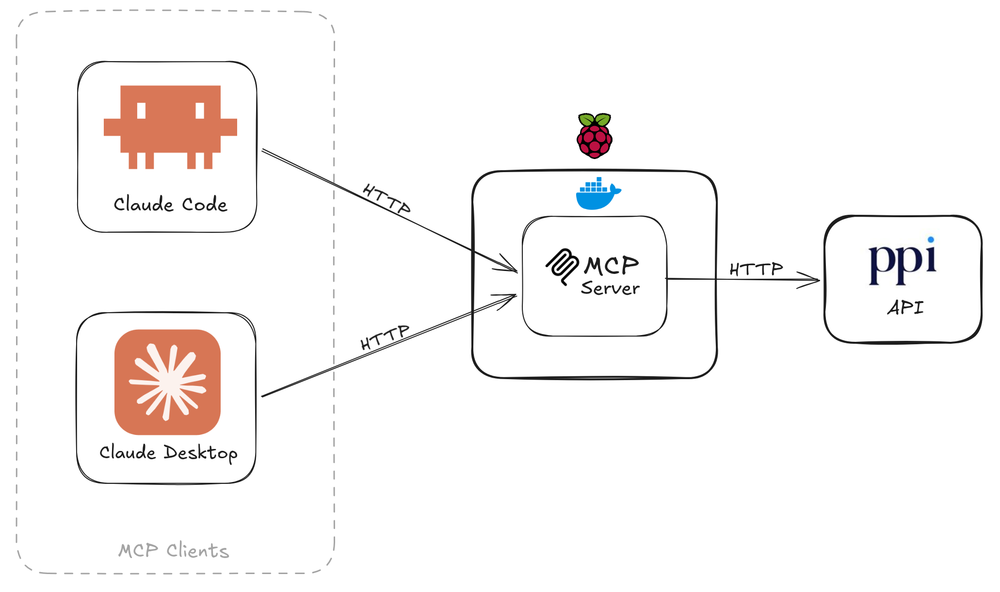
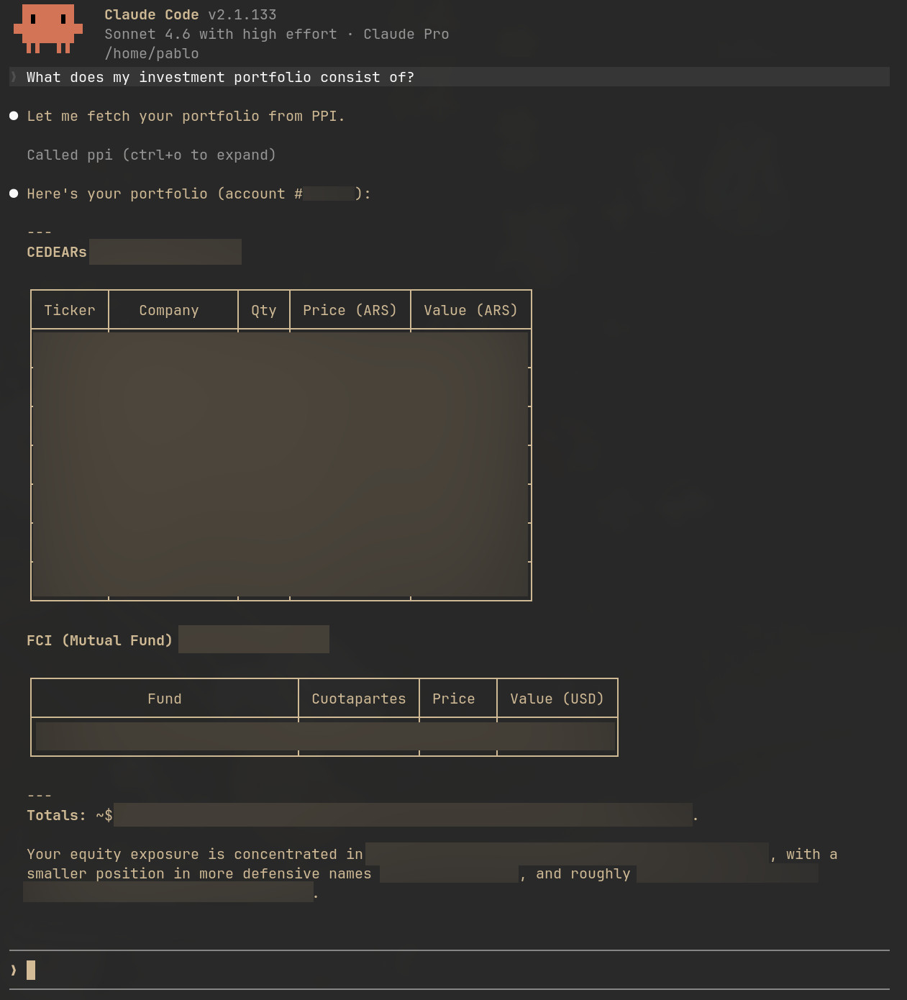

## PPI MCP <a href="https://github.com/PabloMusaber/ppi-mcp" style="color: #6c757d" onMouseOver="this.style.color='#333333'" onMouseOut="this.style.color='#6c757d'" target="githubWindow"><i class="fab fa-github"></i></a>

I asked Claude what was in my financial portfolio. It just figured it out, but... how?

No screenshots, no copy-paste, no me reading numbers off a broker dashboard. It pulled the live position — in pesos and dollars — straight from my broker account, and answered my actual question instead of explaining how to look it up.

The trick is a protocol called **MCP — Model Context Protocol** — and a ~300-line Spring Boot app sitting on a Raspberry Pi in my living room. This post is about how that bridge works, in two parts: **how a Java method becomes a tool Claude can call**, and **how the bridge gets deployed** so two different Claude clients can hit it from anywhere on my LAN.



Claude Code and Claude Desktop on my computer both talk to a single Spring Boot process running on my Raspberry Pi. That process sends requests to the PPI brokerage API. That's the entire stack.

With that stack I can ask things like this:


<br>

---
### What MCP actually is

**Model Context Protocol** is the open spec that defines how AI clients — Claude Code, Claude Desktop, Cursor, Codex, others — discover and call external tools. The name breaks down cleanly: **Model** is the LLM, **Context** is the data and capabilities it needs to be useful, and **Protocol** is the uniform spec for delivering them.

Three roles: a **client** the user talks to, a **server** that exposes tools, and a **transport** that connects them. That's the whole model. Everything else is implementation.

<br>

---
### How a method becomes a tool

A tool is just an annotated method. From `MarketDataTools.java`:

```java
@Tool(name = "ppi_search_instrument", description = """
        Search for financial instruments available on PPI by name or ticker symbol.
        Use this tool first to resolve an instrument name to its exact ticker before calling
        other market data tools. Returns a JSON array; each element has ticker, type, description,
        currency, and market.
        """)
public List<Instrument> searchInstrument(
        @ToolParam(description = "Search query: company name or partial ticker, e.g. 'Apple' or 'AAPL'.")
        String query
) {
    JsonNode node = http.get("/MarketData/SearchInstrument", Map.of("Ticker", query));
    return mapper.convertValue(node, new TypeReference<List<Instrument>>() {});
}
```

Two annotations are doing the work:

- `@Tool` registers the tool by name, plus the **natural-language description the LLM reads when deciding whether to call it.** That description is prompt engineering — write it for the model, not for a human.
- `@ToolParam` documents each argument; Spring AI surfaces it in the schema Claude sees.

The return value is JSON-serialized automatically. No controllers, no DTO mapping, no OpenAPI spec.

The annotation alone doesn't register anything, though. You also need a `ToolCallbackProvider` bean that explicitly hands Spring AI the objects to scan:

```java
@Configuration
public class McpToolsConfig {

    @Bean
    public ToolCallbackProvider ppiTools(MarketDataTools market, AccountTools account, ConfigurationTools config) {
        return MethodToolCallbackProvider.builder()
                .toolObjects(market, account, config)
                .build();
    }
}
```

<br>

---
### Why HTTP, not stdio

For this project, I wanted the MCP bridge to behave like infrastructure, not like a helper process attached to one client session.

`ppi-mcp` runs as a small always-on service on my Raspberry Pi. Claude Code and Claude Desktop both connect to that same service over my LAN. That gives me one deployed bridge, one place to configure it, and one process talking to the broker API.

So HTTP was not a protocol preference in the abstract. It was a deployment choice. The configuration is three lines in `application.properties`:

```properties
spring.ai.mcp.server.stdio=false
spring.ai.mcp.server.protocol=streamable
server.port=2311
```

And the dependency that flips Spring AI into HTTP mode:

```xml
<dependency>
    <groupId>org.springframework.ai</groupId>
    <artifactId>spring-ai-starter-mcp-server-webmvc</artifactId>
</dependency>
```

<br>

---
### What changes once it's running

Once the bridge is up, Claude stops being a tool that summarizes information you paste into it and becomes a tool that can act on live data. I can ask "is my portfolio overexposed to dollar bonds?" and get an answer grounded in my actual positions — not a generic explanation of how to check.

A few things worth keeping in mind if you build something similar:

- **This runs on a LAN, not the internet.** There's no auth layer on the MCP server itself. Keep it off public networks, or add one.
- **The `description` field is your interface contract.** A vague `@Tool` description means Claude will call the wrong tool or skip it entirely. Treat it like a function signature, not a comment.
- **stdio vs. HTTP is a deployment decision, not a quality one.** If you only need one client, stdio is simpler. HTTP earns its added complexity when multiple clients need to share one server.

You can find the project in this [GitHub repository](https://github.com/PabloMusaber/ppi-mcp).
