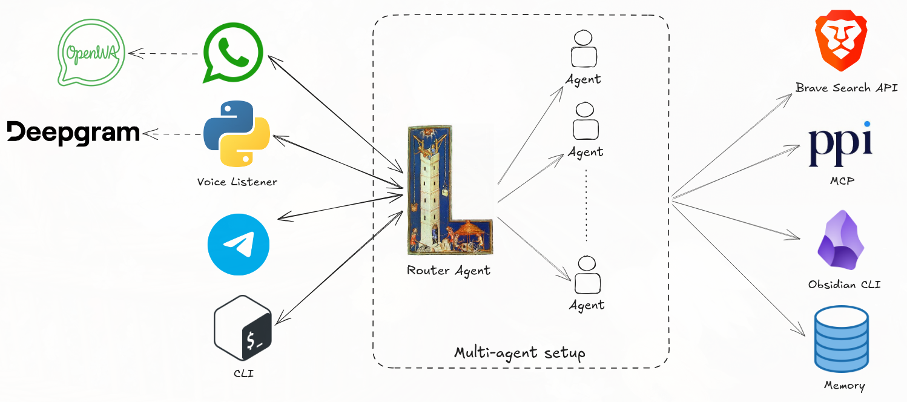

## Watson <a href="https://github.com/PabloMusaber/watson" style="color: #6c757d" onMouseOver="this.style.color='#333333'" onMouseOut="this.style.color='#6c757d'" target="githubWindow"><i class="fab fa-github"></i></a>

A couple of weeks ago, I discovered **[Embabel](https://github.com/embabel/embabel-agent)**, a framework for developing agents in the JVM, from the creator of Spring. This simple description was enough to make me feel I should give it a try.

As a proof of concept, I built **[Watson](https://github.com/PabloMusaber/watson)**, an AI personal assistant to help me with my daily tasks. Basically, I wanted a multi-agent setup with a team of specialists, so I defined the following team:
- **Watson** is the default agent for small talk conversations.
- The **Financial agent** has access to an **[MCP server I created for my personal broker](https://github.com/PabloMusaber/ppi-mcp)**, so it can get information from my personal portfolio and help me think about and discuss my financial decisions.
- The **English Tutor agent** helps me with English corrections when I want to practice my speaking skills.
- The **Knowledge agent** can access my personal Obsidian vault, and can support me in getting information from there.
- The **IT news collector** can handle my requests for news, searching the web and sending me the information that it got. This agent has access to Brave Search MCP Server.

After playing for a while with this framework, I can say that it is solid, readable and pretty customizable. What I appreciate the most is the annotations system, which allows us to write beautiful and simple code. In addition, it has a strong community which works every day to maintain and strengthen the ecosystem.

At this point, with 1.5.1 being the latest version, I consider it mature enough to be used to write production applications and I do not have any doubt that it's going to continue improving in the future.

You can find the project in this [GitHub repository](https://github.com/PabloMusaber/watson).
