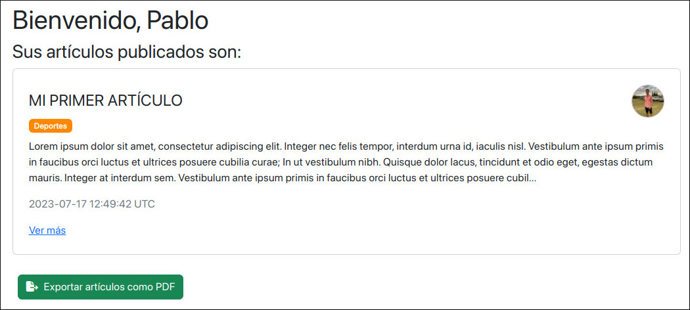
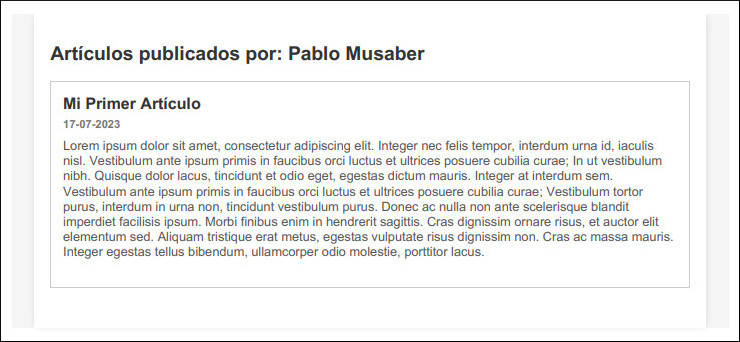
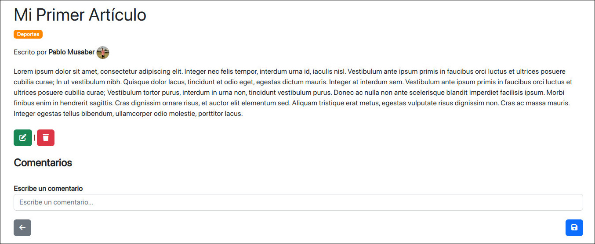
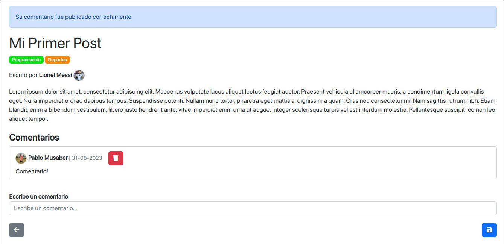

# Ruby on Rails Blog <a href="https://github.com/PabloMusaber/blog-rails" style="color: #6c757d" onMouseOver="this.style.color='#333333'" onMouseOut="this.style.color='#6c757d'" target="githubWindow"><i class="fab fa-github"></i></a>

This project is very simple and was developed to learn and practice with **Ruby on Rails**. It uses the versions:

- **Ruby**: 2.7.0
- **Rails**: 6.1.4

In addition, the gems used are:

- **simple_form**: Simplifies the creation of forms and the display of errors in the corresponding fields.
- **devise**: Provides user authentication with registration, login, password recovery, session management, and account deletion.
- **bootstrap**: Design framework.
- **font-awesome-sass**: Provides a wide collection of icons, mainly used in the application buttons.
- **wicked_pdf**: Allows the generation of PDF files from HTML views.
- **rubocop**: Ruby code analyzer and formatter.

 

After launching the project and logging in, the user can view a list of their created articles displayed as cards. Each card shows the article's title, categories, creation date, and the author's profile picture.

 

By clicking on the “Export articles as PDF” button, a user can generate a PDF file with the entire list of his published articles.

 

In addition, the author of an article is the only user able to edit or delete that item, and therefore is the only one able to display the buttons that allow these functions.

 

The articles can be commented on by any user, as shown below.

 

Finally, I would like to highlight, among other functionalities, the user account management, which is done thanks to the implementation of the **Devise** gem. It allows to make changes to personal data and profile picture, using the password to confirm the changes. In addition, it also facilitates the options of password change and account deletion.

