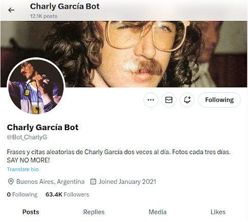

# Bot de Twitter <a class="" href="https://github.com/PabloMusaber/twitter-bot" style="color: #6c757d" onMouseOver="this.style.color='#333333'" onMouseOut="this.style.color='#6c757d'" target="githubWindow"><i class="fab fa-github"></i></a>

El proyecto nació con el propósito de ser destinado a publicar citas e imágenes del artista argentino **Charly García**. El bot fue desplegado y comenzó a funcionar públicamente en julio de 2021 a partir de los servicios de AWS. Desde diciembre de 2022 hasta abril de 2023 funcionó gracias a Railway. La cuenta de Twitter correspondiente al bot es: [@Bot_CharlyG](https://twitter.com/Bot_CharlyG)

 

 

