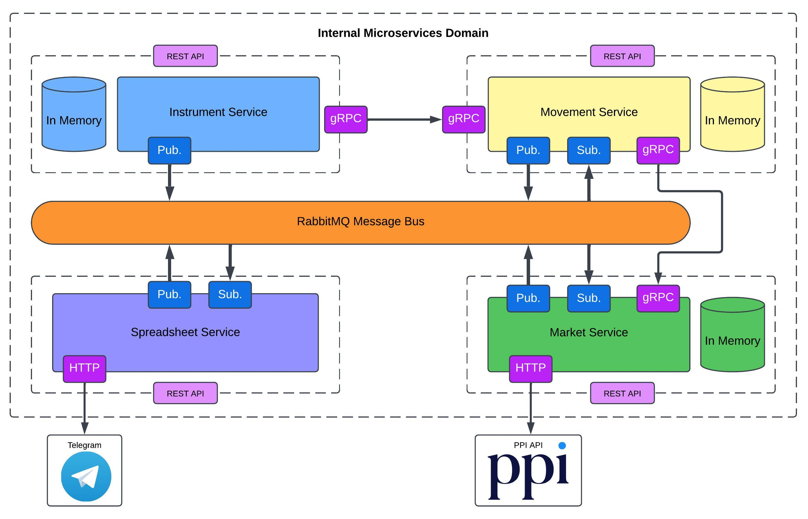

This project was developed to practice microservices architecture and the migration process from a monolithic system to a microservices-based approach. This system consists of 4 microservices with specific responsibilities and independent databases.

##### 1. Instrument Service
- Allows the creation of instruments that represent the different financial assets you want to track.
- Has a database that saves instruments.
- When an instrument is created, it sends this information to _MovementService_ through the RabbitMQ Message Bus.

##### 2. Movement Service
- Allows the creation of movements (buy/sell) for each instrument.
- Has a database that saves movements and instruments.
- At the start, it retrieves all the available instruments in *Instrument Service*.
- When a movement is registered, it calculates the average purchase price and sends it to _MarketService_ through the RabbitMQ Message Bus.

##### 3. Market Service
- Communicates with the **[PPI API](https://itatppi.github.io/ppi-official-api-docs/api/documentacionRest/)** to get the current price for each instrument.
- Has a database with the required information to generate the spreadsheet.
- At the start, it retrieves all the available information in *Movement Service*.
- When a movement is registered, receive the updated information for the specific instrument.
- Sends the necessary information to generate the spreadsheet through the RabbitMQ Message Bus.

##### 4. Spreadsheet Service
- Sends the request to get the necessary information to generate the spreadsheet through *RabbitMQ*.
- Generates the spreadsheet and sends it via _Telegram_.
- Does not have any database.

**Note:** The project is called CEDEARS Tracker, but it can track any financial assets available through the PPI API.

The **solution architecture** is here:

