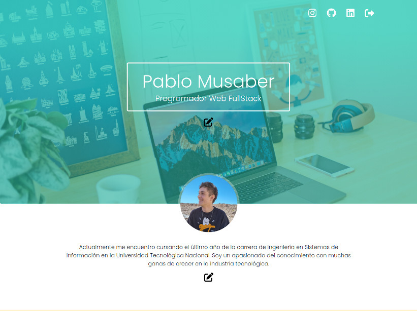

This site was developed as part of the [Argentina Programa](https://www.argentina.gob.ar/economia/conocimiento/argentina-programa) course dictated during the year 2022, with the structure and requirements requested. The goal was to build a personal portfolio that works as a web platform, where the administrator can log in and make all the desired modifications to the information presented within the site.

The frontend of the platform was made with **Angular**, while the backend corresponds to an API developed in **Java with Spring Boot** using a **PostgreSQL** database.

    <strong>Frontend code:</strong> <a href="https://github.com/PabloMusaber/frontend-portfolio" style="color: #6c757d" onMouseOver="this.style.color='#333333'" onMouseOut="this.style.color='#6c757d'" target="websiteWindow"><i class="fab fa-github"></i></a>

    <strong>Backend code:</strong> <a href="https://github.com/PabloMusaber/backend-portfolio" style="color: #6c757d" onMouseOver="this.style.color='#333333'" onMouseOut="this.style.color='#6c757d'" target="websiteWindow"><i class="fab fa-github"></i></a>

As seen in the first image, when accessing as an administrator, there are buttons that allow editing and deleting information in each of the sections of the portfolio.

 

Between 2022 and 2024, the frontend was hosted on **Firebase**, while the backend was powered by **Railway** services. Today the platform is no longer deployed.

