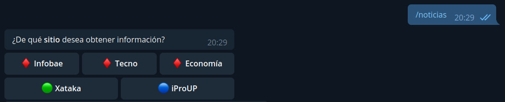
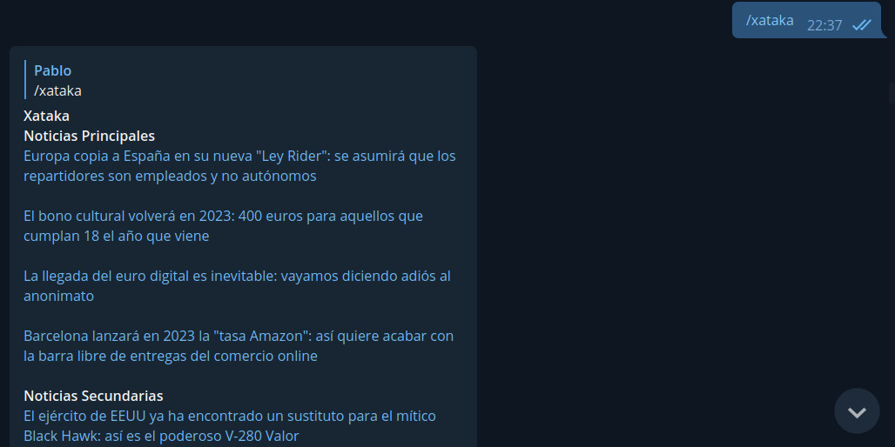
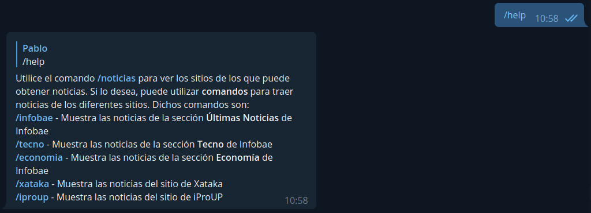

# Bot de Telegram <a href="https://github.com/PabloMusaber/telegram-bot-noticias" style="color: #6c757d" onMouseOver="this.style.color='#333333'" onMouseOut="this.style.color='#6c757d'" target="githubWindow"><i class="fab fa-github"></i></a>

Este bot responde a comandos enviados a través del chat, y era empleado para obtener las noticias principales de Xataka, iProUP e Infobae a partir de scripts de **web scraping**. Actualmente se encuentra fuera de servicio debido a que ya no lo utilizo.

Las noticias pueden solicitarse a partir de la interacción con los botones que aparecen con el comando **"/noticias"**.

 

Al presionar sobre alguno de los botones, se obtiene el listado de títulos de las últimas noticias del sitio seleccionado, del mismo modo que ocurre al utilizar los comandos. Al clickear alguno de los títulos, se abre una pestaña del navagador predeterminado con la noticia especificada.

 

Además, con el comando **"/help** se obtiene información sobre el uso del bot.

 

