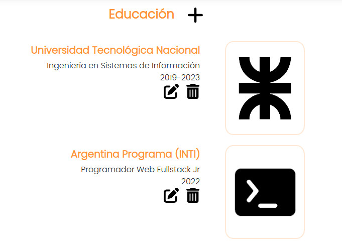

# Portfolio Web <a href="https://pablomusaber.web.app/" style="color: #6c757d" onMouseOver="this.style.color='#333333'" onMouseOut="this.style.color='#6c757d'" target="websiteWindow"><i class="fas fa-link"></i></a>

Este sitio fue desarrollado como parte del curso [Argentina Programa](https://www.argentina.gob.ar/economia/conocimiento/argentina-programa) dictado durante el año 2022, con la estructura y requisitos solicitados. El objetivo era construir un portfolio personal que funcione como plataforma web, donde el administrador pueda iniciar sesión y realizar todas las modicaciones deseadas a la información presentada dentro del sitio.

El frontend de la plataforma fue realizado con **Angular**, mientras que el backend corresponde a una API desarrollada en Java con **Spring Boot** y utiliza una base de datos **PostgreSQL**.

    <strong>Código frontend:</strong> <a href="https://github.com/PabloMusaber/frontend-portfolio" style="color: #6c757d" onMouseOver="this.style.color='#333333'" onMouseOut="this.style.color='#6c757d'" target="websiteWindow"><i class="fab fa-github"></i></a>

    <strong>Código backend:</strong> <a href="https://github.com/PabloMusaber/backend-portfolio" style="color: #6c757d" onMouseOver="this.style.color='#333333'" onMouseOut="this.style.color='#6c757d'" target="websiteWindow"><i class="fab fa-github"></i></a>

Como se observa en la primera imágen, al acceder como admin, se pueden observar botones que permiten editar y eliminar la información en cada una de las secciones del portfolio.

 

A pesar de que no esté en uso, la plataforma se encuentra desplegada <a href="https://pablomusaber.web.app/" style="color: #6c757d" onMouseOver="this.style.color='#333333'" onMouseOut="this.style.color='#6c757d'" target="websiteWindow"><i class="fas fa-link"></i></a>. El frontend se encuentra alojado en **Firebase**, mientras que el backend funciona gracias a los servicios de **Railway**.

